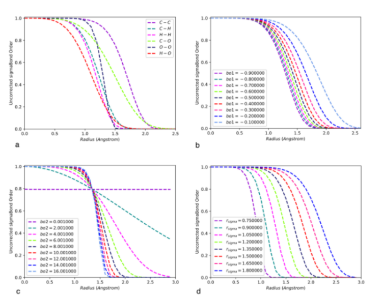
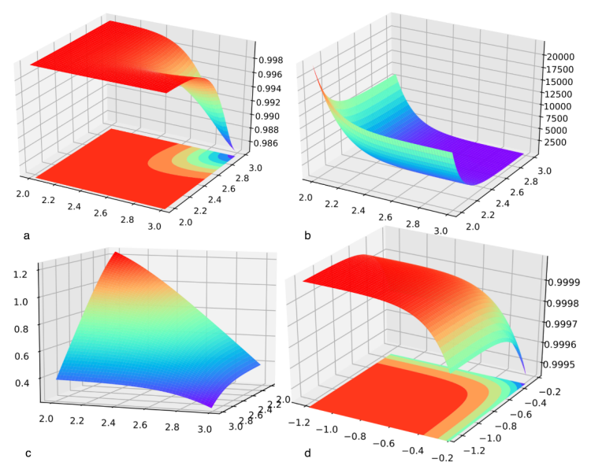
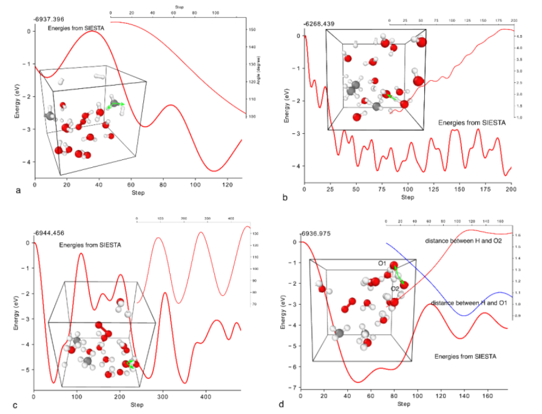

# I-ReaxFF 使用手册

Author: Guo Feng

Email: fengguo@lcu.edu.cn or gfeng.alan@foxmail.com

---

## 1  I-ReaxFF软件安装
I-ReaxFF软件主要运行的操作系统为Linux系统，Window系统也能安装使用，但效率低下，不推荐。 I-ReaxFF使用Python程序语言开发，少量代码使用cython开发。使用了少部分python的第三方库，首先要对这些依赖库进行安装。如NumPy, 可视化库matplotlib, ase (Atomic Simulation Environment)模块, 谷歌开源机器学习框架TensorFlow。以上模块均可通过python包管理器pip命令安装，如安装NumPy：

```bash
 pip install numpy -user -upgrade
```
cython也可通过pip包管理器进行安装：

```bash
   pip install cython -user -upgrade
```
在安装完以上依赖包以后，通过setup.py安装I-ReaxFF， 
```bash
   python setup.py install -user 
```
## 2 I-ReaxFF简介
 ReaxFF是化学反应的分子动力学力场，有着广泛的应用，如Pt-O体系的研究1,2 ，由van Duin3 于2001年开发，应用于含能材料体系的经典力学的反应性力场。ReaxFF利用键级思想，最早由Tersoff及Berenner在Tersoff势及REBO势中使用。基于键级思想，化学键在不同的化学环境中具有不同的能量，如近邻原子数，原子距离等，未修正的键级的计算公式（1-3）：
$$
BO_{\sigma}^{\prime} = exp[bo_1 \cdot (\frac{r}{r_\sigma})^{bo_2}]
$$

$$
BO_{\pi}^{\prime} = exp[bo_3 \cdot (\frac{r}{r_\pi})^{bo_4}]
$$

$$
BO_{\pi\pi}^{\prime} = exp[bo_5 \cdot (\frac{r}{r_\pi\pi})^{bo_6}]
$$

$BO_{\sigma}^{\prime}$、$BO_{\sigma}^{\prime}$、$BO_{\sigma}^{\prime}$取值范围均为0～1。如图1所示。

<div align=center></div>
​                                               图1. 未修正键级$BO_{\sigma}^{\prime}$值随r、参数$bo_1$、$bo_2$、$r_\sigma$的变化曲线。

键级值$BO_{\sigma}^{\prime}$、$BO_{\pi}^{\prime}$、$BO_{\pi\pi}^{\prime}$进一步被函数$f_{1-4}$修正，如下述公式所示：
$$
f_1(\Delta^{\prime}) = \frac{1}{2} ( 
 \frac{Val + f_2(\Delta^{\prime})}{Val + f_2(\Delta^{\prime}) + f_3(\Delta^{\prime}) } +
 \frac{Val^T + f_2(\Delta^{\prime T})}{Val + f_2(\Delta^{\prime T}) + f_3(\Delta^{\prime T}) }
$$

$$
f_2(\Delta^{\prime}) =exp(-boc_1 \Delta^\prime) + exp(-boc_1 \Delta^{\prime T})
$$

$$
f_3(\Delta^{\prime}) = -\frac{1}{boc_2} ln \frac{1}{2} [
exp(-boc_2 \Delta^\prime) + exp(-boc_2 \Delta^{\prime T})
]
$$

$$
f_4(\Delta^{\prime}) = -\frac{1}{1+
exp[-boc_3 \cdot (boc_4 \cdot BO^{\prime 2} -\Delta^{\prime T} -Val_{boc} ) + boc_5 ]
}
$$

上述公式均为两元函数，即形成化学键的两个原子的$\Delta^{\prime}$值。$\Delta^{\prime}$值为原子所形成化学键的键级之和，由下式计算：
$$
\Delta^{\prime} = \sum_{i \ne j} BO^\prime
$$

在程序设计过程中，使用了大量的矩阵运算代替循环来提高程序的执行效率，如$BO^{\prime}$为（$ N_{atom} \times N_{atom}$）的二维矩阵，而$\Delta^{\prime}$的计算可通过TensorFlow中的求和函数计算得到：$\Delta^{\prime}$ = tf.reduce_sum(,0)，其中第二个参数为求和的维度。$f_{1-4}$函数图象如图2所示。

<div align=center></div>
​                                                    图2. $f_{1-4}$函数随成键两个原子$\Delta^{\prime}$ 值的变化曲面。

如正确描述化学键断裂与形成过程，需恰当的截断函数，我们采用了如下式所示的截断函数：

$$
f_{cutoff}(r) = 
\begin{pmatrix}
 1.0 & r>r_{max}\\
\frac{(r_{min}+2r-3r_{max})(r_{min}-r)^2}{(r_{min}-r_{max})^3} & r_{min}<r<r_{max}\\
0.0  & r<r_{min}
\end{pmatrix}
$$

<div align=center></div>

​                                               图3. 分子结构的键角、键长的变化、能量值的变化。

I-ReaxFF可自动从第一性原理动力学（AIMD）的计算结果中收集数据做为训练集，图3展示了变量的变化及能量的变化曲线。

## 3  I-ReaxFF使用参数说明

从I-ReaxFF中引入训练模块：
```python
import irff.reax import ReaxFF 
```

或训练ReaxFF-nn模型，需导入
```python
import irff.mpnn import MPNN
```
训练数据集定义：
```python
dataset={'nm2_23':'nm2_23.traj',
         'nm2_24':'nm2_24.traj'}
```
dataset中定义了两个ASE Trajectory文件，这两个轨迹均是包含SIESTA-MD (AIMD)计算结果文件，定义ReaxFF对象，’ffield’为初始参数文件。一般使用如下：
```python
rn = ReaxFF(libfile='ffield',
            dataset=dataset,
            cons=None,
            batch_size=50,
            losFunc='n2',
            bo_penalty=100000.0)
```
可使用ReaxFF对象的run模块开始训练：
```python
rn.run(learning_rate=1.0e-4,step=1000000,print_step=10,writelib=1000) 
```
所有参数均可查询源程序得到具体的含义： 
```python
class ReaxFF(object):
  def __init__(self,libfile='ffield',dataset={},
               dft='ase',atoms=None,
               cons=['val','vale'],
               opt=None,optword='nocoul',
               batch_size=50,sample='uniform',
               hbtol=0.01,
               vdwcut=10.0,
               hbshort=6.75,hblong=7.5,
         ......
```

### 3.1 部分参数详细说明

cons: 设定列表中的变量在优化过程中保持不变。

opt: 设定列表中的变量将被优化（cons和opt不能同时设置）。

optword: 可以设置为nocoul、novdw、notor、all，

batch_size: 所有数据被分割成batch_size大小，以进行矩阵计算，大小设置会影响计算速度，默认为50。

sample:抽样方法，可先uniform，均一抽样，random随样抽样。

hbtol: 形成氢键键级最小值。

hbshort, hblong: 氢键结构X-H...Y中X-Y长度的取值范围。

vdwcut: vdw相互作用的截断半径。

clip：对参数取值范围进行限制，数据格式为字典，例如将参数“bo1”限制在（-0.1，0.01）之间：clip={‘bo1’:(-0.1,-0.01)}。

spec: 结构中的化学元素种类，不设置将自动从ffield中获取。

bo_penalty：促进收敛的选项。

losFunc：损失函数，可选n2、abs、mse、huber, 分别对应范数2、绝对差、均方差和结合了均方差和绝对值二者特长的huber式损失函数。

