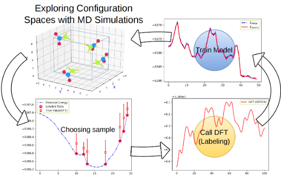

1. example_ch4h2o: A example for building a machine learning potential from SIESTA calculations for a simple system, contains H2O and CH4 molecules.
2. example_c     : A example for building a machine learning potential from Quantum Espresso DFT calculations for Carbon.
3. example_reax  : A example for using a machine learning algorithoms training the ReaxFF parameters.
4. example_phonon: Using Phononpy and GULP compute the 2rd order force constant
4. example_fox   : training ReaxFF-nn with atomic forces

## Introductions for building a mathine learning potential

### I. Use the following command to run the train process
```bash
nohup ./train.py --f=1 --t=1 --s=10000 --z=1 > py.log 2>&1 &
```
* options:

--f: whether optimize the four-body parameter

--t: whether optimize the three-body parameter

--h: whether optimize the hydrogen-bond parameter

--z: whether evaluate the zero point energy

--s: the train step

### II. Add new data (structure) to the current training data-set

1. A structure file should be constructed, in the ".gen" format, it can early be converted from POSCAR file, 
   if you familiar with this format, for example, using ASE code:
```python
from ase.io import read,write

atoms=read('POSCAR')
atoms.write('structure_name.gen')
```

2. prepare the md.traj file

   The md.traj file contains the structures from the potential energy surface, it canbe the trajectories of a short time molecular dynamics simulations, or it canbe strech the valence bond, or rotate the a functional group, or swing a valence angle. 
  
   This step is iteratively repeated, till performence of the potential satisfactory. 

3. run the lm.py script to call DFT calculation and trian the new data 
```bash
nohup ./lm.py --f=1 --t=1 --s=10000 --z=1 > py.log 2>&1 &
```
4. convert the parameter file "ffield.json" to the GULP format or lammps format

to GULP format
```bash
./json_to_lib.py
```
to LAMMPS format
```bash
./json_to_ffield.py
```
These two script can be found in "I-ReaxFF/tools/" directory.

The big picture of the training process:



### III. Introduction of "train.py" script and "lm.py" script
* train.py
Using script 'train.py' to train the model, type the following command in the Linux shell:
```shell
./train.py
```

a typical output is like following:
```shell
-  step: 60 loss: 0.0015 accs: 0.94 fox-7: 0.97 cl20-0: 0.91 force: 0.112 pen: 32.27 me: 8.40 time: 5.14
-  step: 70 loss: 0.0015 accs: 0.95 fox-7: 0.97 cl20-0: 0.92 force: 0.112 pen: 32.32 me: 8.40 time: 5.17
-  step: 80 loss: 0.0015 accs: 0.95 fox-7: 0.97 cl20-0: 0.92 force: 0.112 pen: 32.24 me: 8.40 time: 5.26
```
where
```shell
loss : energy loss per atom, energy in unit eV;
accs : the total accuracy of the model, the value is in range 0~1;
force: forces loss per atom, forces in unit eV/angstrom;
pen  : sum of penalty terms, such as regularize therm of parameters, bond-order should be zero at the bond cutoff;
me   : structure energy, it should be neglected, no real meaning;
time : time usage till last print out.
fox-7/cl20-0: accuracy for this structure, the value is in range 0~1;
```
* lm.py

A learning machine that sampling the 'md.traj', and the sampled structures will be labeled by DFT calculation, currently only support SIESTA, but is very easy to implement other DFT calculators with the help of ASE.

(The ASE trajectory object must contain energies and forces attribute for forces learning.)
