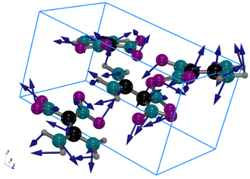

## Training a machine learning model with atomic forces

### 1. prepare data for the training

The training data can calculate by any method, but data must in ASE trajectory format. A convenient way to prepare '.traj' file is using ASE calculator(refer to ASE manual for details), after calculations the trajectory file will generated automatically. Another way is using our learning machine (as show the 'lm.py' script in this directory), but only support SIESTA currently.

### 2. training the machine learning model with data collected in step 1.

Using script 'train.py' to train the model, type the following command in the Linux shell:
```shell
./train.py
```

a typical output is like follow:
```shell
-  step: 60 loss: 0.0015 accs: 0.94 fox-7: 0.97 cl20-0: 0.91 force: 0.112 pen: 32.27 me: 8.40 time: 5.14
-  step: 70 loss: 0.0015 accs: 0.95 fox-7: 0.97 cl20-0: 0.92 force: 0.112 pen: 32.32 me: 8.40 time: 5.17
-  step: 80 loss: 0.0015 accs: 0.95 fox-7: 0.97 cl20-0: 0.92 force: 0.112 pen: 32.24 me: 8.40 time: 5.26
```

where
```shell
loss: energy loss per atom, energy in unit eV;
accs: the total accuracy of the model, the value is in range 0~1;
fox-7/cl20-0: accuracy for this structure, the value is in range 0~1;
pen: sum of penalty terms, such as regularize therm of parameters, bond-order should be zero at the bond cutoff;
me: structure energy, it should be neglected;
force: forces loss per atom, forces in unit eV/\AA;
time: time usage till last print out.
```